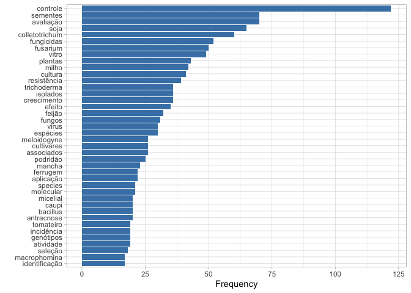
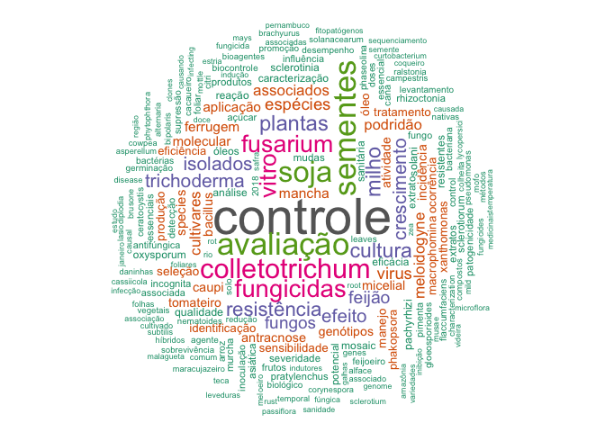

+++
date = 2019-08-25
lastmod = 2019-08-25
draft = false
categories = ["Survey", "Community"]
tags = ['Programming', 'Survey', 'Reproducibility']
title = 'What are Brazilian plant pathologists doing? a text-analysis of scientific poster titles'
math = true
summary = """
A text analysis of the titles of more than 700 posters to be presented at the 51 CBFito in Brazil 
"""
 
[header]
image = ""
caption = ""

+++


## Motivation

The  scientific conference promoted by the [Brazilian Society of Plant Pathology](http://sbfitopatologia.org.br/) (SBF) is the primary venue for local scientists to present their research data. Among the different ways of delivering science and receiving feedback, poster presentation is tradition and central at the meeing. They might provide the largest amount of the least biased (not by invitation) information on the current and future status of research in the field. Most commonly, summaries of work presented in a conference are based on the number of abstracts per subarea or number of results from a keyword-based search. I have played with text analysis in a [recent research article](https://apsjournals.apsnet.org/doi/full/10.1094/PHYTO-02-17-0069-FI#fig2) and thought it could be useful here to identify the most frequent research areas to be presented at the [51CBFito meeting](http://cbfito2019.com.br/). I also wanted to learn new coding and, of course, share what I've learned. 


## Sources of data

I started looking for the data and found a PDF file with a list of poster titles of organized by sessions. I was not succesful in extracting information from that file using *pdftools* package the way I would like to. I gave up using that source and asked the organizers if there was another format - different from a spreadsheet. They sent me a link to a [webpage](http://cbfito2019.com.br/index.php?page=portugues) that displays a two-column table with posters IDs and the poster titles in Portuguese. That worked much better and was a chance for me to learn about scraping (harvesting) data from webpages using the [*rvest*](https://rvest.tidyverse.org/index.html) package. 


## Time to harvest

It was rather easy to follow the examples of codes on how to read data from a table in a webpage and store data in a list, which can to be converted to a dataframe. 


```r
library(rvest)
library(tidyverse)
cbfito <- read_html("http://cbfito2019.com.br/index.php?page=portugues") %>%
  html_table() %>%
  map_dfr(`[`, c("ID", "Título")) %>%
  rename("title" = "Título") # rename column name to English 

write_csv(cbfito, "cbfito.csv") # storing in csv file in case the URL breaks!
cbfito <- read_csv("cbfito.csv")

nrow(cbfito) # diplay the total number of posters
```

```
## [1] 706
```


## Text analysis

Now that I got the data on 706 posters, a [tidy](https://www.tidyverse.org/) approach was used to analyse the text. The `unnest_tokens()` function allows to extract all words and store as a new variable.


```r
library(tidytext)
library(tidyr)
cbfito_words <- cbfito %>%
  unnest_tokens(word, title)
head(cbfito_words)
```

```
## # A tibble: 6 x 2
##   ID     word       
##   <chr>  <chr>      
## 1 ID 381 screening  
## 2 ID 381 da         
## 3 ID 381 atividade  
## 4 ID 381 antifúngica
## 5 ID 381 in         
## 6 ID 381 vitro
```

The dataframe contains the ID variable and a new one called *word* with the individual words. Let's see if there is any numeric string arranging data in the column by `word` variable. 


```r
cbfito_words %>%
  arrange(word) %>% 
  head(10)
```

```
## # A tibble: 10 x 2
##    ID     word 
##    <chr>  <chr>
##  1 ID 263 1    
##  2 ID 730 1    
##  3 ID 791 1    
##  4 ID 50  17   
##  5 ID 249 19   
##  6 ID 789 19   
##  7 ID 53  2    
##  8 ID 495 2004 
##  9 ID 495 2014 
## 10 ID 219 2016
```

As we can see above there are some integers that I want to eliminate from the dataset together with the entire ID column. 


```r
cbfito_words %>%
  filter(!str_detect(word, "[0-10000]")) %>% 
  select(word)
```

```
## # A tibble: 9,757 x 1
##    word       
##    <chr>      
##  1 screening  
##  2 da         
##  3 atividade  
##  4 antifúngica
##  5 in         
##  6 vitro      
##  7 de         
##  8 óleos      
##  9 essenciais 
## 10 sobre      
## # … with 9,747 more rows
```

Now he dataframe is composed of a single column with all words. Let's view the 20 most frequent words. 


```r
cbfito_words %>%
    count(word, sort = TRUE) %>%
  mutate(word = reorder(word, n)) %>% 
  head(20)
```

```
## # A tibble: 20 x 2
##    word               n
##    <fct>          <int>
##  1 de              1159
##  2 em               263
##  3 da               249
##  4 do               214
##  5 no               185
##  6 e                167
##  7 of               141
##  8 in               129
##  9 a                127
## 10 controle         122
## 11 na               102
## 12 avaliação         70
## 13 sementes          70
## 14 soja              65
## 15 com               64
## 16 colletotrichum    60
## 17 spp               55
## 18 o                 54
## 19 à                 53
## 20 fungicidas        52
```

The most frequent words in a language are called [stop words](https://en.wikipedia.org/wiki/Stop_words). There are several of those both in Portuguese and in English which I do not want them to appear in our analysis as we are interested in more technical terms. To eliminate them, we need to find a list of stopwords. I found a few lists and picked this one set from [this website](http://www.labape.com.br/rprimi/ds/stopwords.txt) that contained higher number of stop words in Portuguese. 


```r
stopwords_pt <- read_csv(
  file = "http://www.labape.com.br/rprimi/ds/stopwords.txt",
  col_names = FALSE
)
names(stopwords_pt) <- "word"
```

Let's now remove all stopwords in both languages using the [anti_join](https://dplyr.tidyverse.org/reference/join.html#join-types) function.


```r
cbfito_words2 <- cbfito_words %>%
  anti_join(stopwords_pt) %>%
  anti_join(stop_words) # this is a list of English stopwords from the tidytext pkg
```

Let's have another close look at the list of words and check if there are some field-specific words that we want to eliminate.


```r
cbfito_words2
```

```
## # A tibble: 6,330 x 2
##    ID     word         
##    <chr>  <chr>        
##  1 ID 381 screening    
##  2 ID 381 atividade    
##  3 ID 381 antifúngica  
##  4 ID 381 vitro        
##  5 ID 381 óleos        
##  6 ID 381 essenciais   
##  7 ID 381 sobre        
##  8 ID 381 fitopatógenos
##  9 ID 253 desempenho   
## 10 ID 253 fungicidas   
## # … with 6,320 more rows
```

I went through the list and could find a few words that I want to eliminate due to lack of relevance for this summary. I did it manually considering that I had "only" 2,000 words, but I checked those cited at least twice. See below a way to exclude those words.


```r
words_freq <- cbfito_words2 %>%
  filter(!word %in% c(
    "spp", "sp", "sob", "sobre", "pv", "uso", "diferentes", "estado", "sob", "brasil", "brazil", "doenças",  "desenvolvimento", "soybean", "pós", "contra", "identification", "diversity", "formas", "hosts")) %>%
  count(word, sort = TRUE) %>%
  mutate(word = reorder(word, n))

words_freq
```

```
## # A tibble: 2,136 x 2
##    word               n
##    <fct>          <int>
##  1 controle         122
##  2 avaliação         70
##  3 sementes          70
##  4 soja              65
##  5 colletotrichum    60
##  6 fungicidas        52
##  7 fusarium          50
##  8 vitro             49
##  9 plantas           43
## 10 milho             42
## # … with 2,126 more rows
```

## Visualization

Using barplos gives us an idea of the number of different works containing the word in the title  - assuming that the word is not repeated in the same poster title.


```r
words_freq %>% 
  head(40) %>% 
  ggplot(aes(reorder(word, n), n))+
  geom_col(fill = "steelblue")+
  coord_flip()+
  theme_light()+
  labs(y = "Frequency", x = "")
```

<!-- -->


Using barplots we have limitations in space. Also, it does not make sense to plot too many words with just a few occurrences. A nice solution for more crowdy data is to produce a wordcloud plot. In the code to produce the wordcloud, I defined a maximum of 200 words that appeared at least twice to be shown in the plot.


```r
library(wordcloud)
library(RColorBrewer)

words_freq %>%
  # filter(n > 5) %>%
  with(wordcloud(word,
    n,
    scale = c(3.5, 0.4),
    max.words = 200,
    min.freq = 2,
    random.order = FALSE,
    rot.per = 0.40, colors=brewer.pal(8, "Dark2")))
```

<!-- -->

## Conclusion

To answer the original question, the analysis showed that among 706 posters in total that will be presented, most of them evaluated disease control methods based on the use of fungicides, host resistance or biological control (**Trichoderma** and **Bacillus**) both in the field and under in vitro conditions. The most studied crops are soybean, maize, common bean, cowpea and tomato and the most common diseases are caused by fungi (**Colletotrichum**, **Fusarium**) followed by nematodes (**Meloidogyne**) and viruses. 

Text analysis is an interesting approach and could be expanded to answer different questions should more information be available. For example, if each poster was associated with a specific session, that could be taken into account in the analysis. Maybe some kind of network analysis could be used to check which two or more words tend to appear more frequently together (same study). For example, for which group of pathogen was identification more common. Virus? bacteria? What are the most common control methods studied in soybean? are they the same as in other crops? Trends in research over time could be identified should text data on presentations from previous conference be available.


